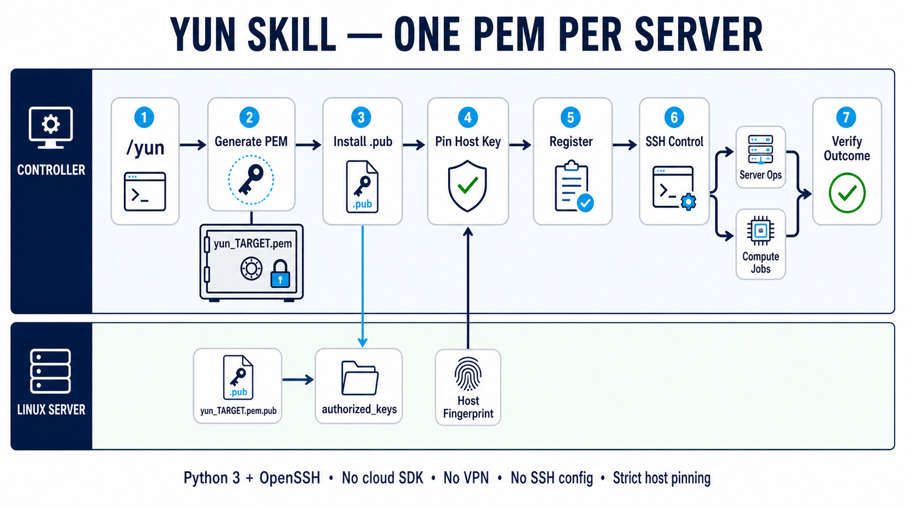

# 云（`/yun`）

一个可移交给其他 Codex 智能体使用的 Linux 服务器控制 Skill：一台服务器对应一个专用 RSA-4096 PEM，直接通过 OpenSSH 管理服务器，也可以提交、观察、取消和取回持久计算任务。



## 需求状态

| 需求 | 状态 | 实现 |
| --- | --- | --- |
| 一个 PEM 对应一个服务器 | 已完成 | 注册表把一个目标绑定到一个绝对 `.pem` 路径、拒绝两个目标复用同一 PEM；SSH/SCP 强制只使用该身份 |
| 不依赖 SSH 别名或外部平台 | 已完成 | 每次连接都直接使用主机、端口、用户、PEM 和固定的服务器指纹，并使用 `-F none` 禁用 SSH 配置 |
| 能产生密钥 | 已完成 | `keygen` 只产生 RSA-4096 真 PEM 私钥及其安装用 `.pem.pub` 公钥；不会进入口令/agent 依赖 |
| 其他智能体可重复使用 | 已完成 | `SKILL.md` 定义固定入口、接入分支、服务器分支、计算分支、安全边界和完成条件 |

普通服务器控制的软件依赖只有：控制端的 Python 3 标准库与 OpenSSH 客户端，以及目标 Linux 上可访问的 `sshd`。不要求 Tailscale、云厂商 SDK、MCP 或用户的 `~/.ssh/config`。专用 `known_hosts` 文件和服务器指纹是防止中间人攻击所需的安全数据，不是额外服务依赖。计算任务分支才额外要求服务器具有 Bash、tmux 和 setsid。

## 最小使用路径

在 Skill 根目录执行：

```bash
python scripts/yunctl.py init
python scripts/yunctl.py keygen my-server
```

本地会得到且不会覆盖：

```text
~/.ssh/yun_my-server.pem
~/.ssh/yun_my-server.pem.pub
```

私钥为无人值守控制专用的无口令 PEM，由工具收紧本机文件权限，并且只留在控制端。通过服务器控制台或已有管理员通道，把 `.pem.pub` 的单行公钥安装到目标账户的 `~/.ssh/authorized_keys`；再通过独立可信通道核对服务器 ED25519 host key，保存专用 `known_hosts` 文件。

注册一条不依赖 SSH 配置的直接连接：

```bash
python scripts/yunctl.py register my-server \
  --host 203.0.113.10 \
  --port 22 \
  --user deploy \
  --pem /absolute/path/yun_my-server.pem \
  --known-hosts /absolute/path/yun_my-server.known_hosts \
  --host-fingerprint SHA256:VERIFIED_FINGERPRINT \
  --role server \
  --description "authorized server"
```

验收并执行只读命令：

```bash
python scripts/yunctl.py probe my-server
python scripts/yunctl.py exec my-server --read-only -- hostname
```

完整的新服务器接入方法见 [references/onboarding.md](references/onboarding.md)，普通运维见 [references/servers.md](references/servers.md)，持久计算闭环见 [references/compute.md](references/compute.md)。

## 安全模型

- 私钥内容、口令、Token 和已填充的环境文件永不进入 Skill、注册表、命令参数或日志。
- 所有 SSH/SCP 调用关闭 SSH 配置和环境中的 agent，只允许注册的 PEM 公钥身份。
- 每次网络操作前都核对专用 `known_hosts` 与登记的 SHA256 host fingerprint；禁止 `accept-new` 和关闭 host checking。
- 生产目标写操作需要显式目标确认；部署、重启、取消任务和清理仍受用户授权范围约束。
- “提交成功”不等于“计算完成”：计算分支必须观察终态和退出码，检查日志并取回结果，才算闭环。

验证命令：

```bash
python -m unittest discover -s tests -v
python -m py_compile scripts/yunctl.py
```
